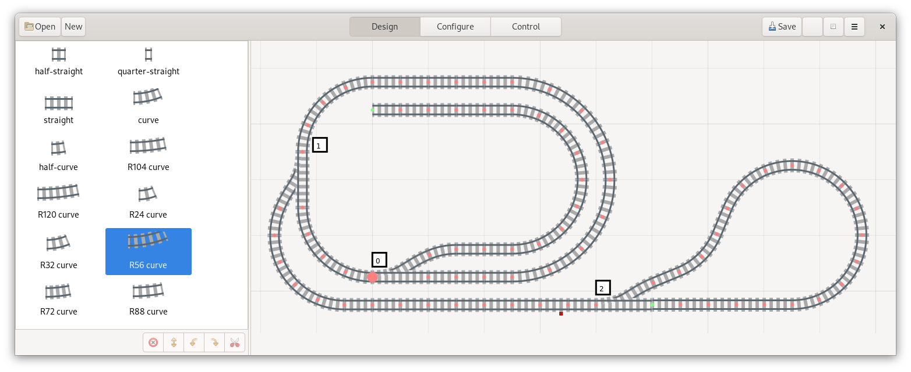

.. Lego Train Automation documentation master file, created by
   sphinx-quickstart on Sun Jun  7 21:27:54 2020.
   You can adapt this file completely to your liking, but it should at least
   contain the root `toctree` directive.

Welcome to the documentation for *Let's Go! Trains*
===================================================

   Screenshot of *Let's Go! Trains*

*Let's Go! Trains* is a GTK application for planning and automating LEGO® train layouts.

Contents:

.. toctree::
   :maxdepth: 2
   :caption: Contents:

   using/index
   track-library/index
   extending/index
   ref/index

Indices and tables
==================

* :ref:`genindex`
* :ref:`modindex`
* :ref:`search`
